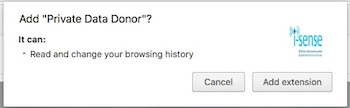
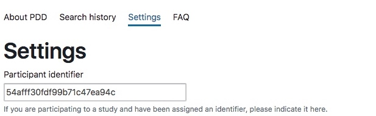

This page is intended for participants coming from the [Prolific platform](https://www.prolific.ac/).
It provides instructions to get started.
To participate to the study, you should fulfil the following requirements:

* Be using Chrome (or Chromium) as your main Web browser.
* Be using Google on a daily basis to perform searches.

Note that we do not require participants to modify their behaviour in any way, just to use these tools as they would normally for two weeks.

Please follow carefully the instructions until the end.
It should not take more than 15 minutes.

## 1. Install the Chrome extension

The Private Data Donor is hosted on the official Chrome Web Store, on the following page:
[https://chrome.google.com/webstore/detail/private-data-donor/ipeekohlgfhagcopnndkgoommcihmdmk](https://chrome.google.com/webstore/detail/private-data-donor/ipeekohlgfhagcopnndkgoommcihmdmk)

Then, click on the blue button labeled "Add to Chrome" to actually install the extension.

{: .center}

Finally, will have accept the permissions that the extension requires.
We only need to access your browsing history, in order to monitor the searches you do on Google.

{: .center}

## 2. Fill in your Prolific ID

Just after the extension is installed, the options page should open automatically.
If it is not the case, or if you already closed it, you can access the options at any time by clicking on the button that has appeared at the far right of your address bar:

{: .center}

Then click on the "Settings" tab, and fill in your Prolific ID:

{: .center}

Take care of mentioning the actual Prolific ID that has been assigned to you by the platform.
This step allow us to verify that you actually installed the extension, validate your participation and ultimately allow your payment.
**We cannot allow your payment if this step is not fulfilled correctly.**

## 3. Confirm your participation on Prolific

Now that the extension is installed and configured, please confirm your participation on the Prolific platform, by visiting the following page:
[https://www.prolific.ac/submissions/complete?cc=ANVMDG4N](https://www.prolific.ac/submissions/complete?cc=ANVMDG4N)

## 4. Keep using Chrome and Google for two weeks

The only thing we ask you is to use Chrome to keep performing Google searches on a daily basis, as you would normally do.
As the extension is running in the background, you do not have anything else to do.

For your payment to be performed in full, we require to receive at least **10 days of data (out of 14)**.

After that period of time, you may freely remove the extension from your browser.
